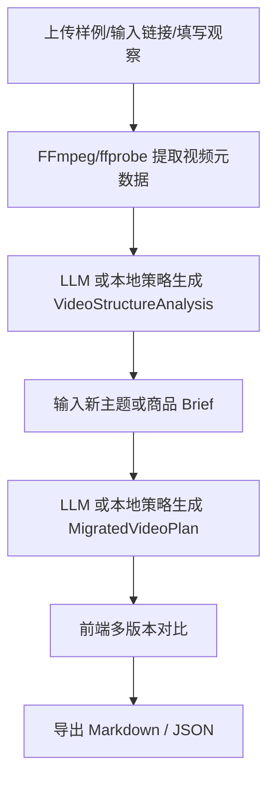

# 爆款结构迁移引擎总体方案

关联需求：[[项目要求]]

> [!info] 项目定位
> 面向短视频创作场景，从一条或多条优质样例中拆解“创作方法”，再迁移到新主题、商品或素材中，生成可编辑的方案脚本。

## 一、第一版目标

第一版按比赛 MVP 实现，交付一条完整可演示链路：

1. 输入样例视频、样例链接或人工观察文本。
2. 拆解开头 Hook、镜头节奏、字幕布局、画面包装、音乐卡点、卖点推进和结尾转化。
3. 输入新主题或商品 Brief。
4. 生成 3 个可比较的视频方案脚本版本。
5. 导出 Markdown 和 JSON，方便继续在 Obsidian 或其他工具中编辑。

V1 不做真实 MP4 自动合成，不接文生视频或图生视频，核心价值放在“结构迁移”和“可编辑脚本”。

## 二、技术栈

| 模块 | 技术 |
| --- | --- |
| Web 框架 | Next.js + React + TypeScript |
| UI | Tailwind CSS + shadcn/ui 风格组件 + lucide-react 图标 |
| AI 调用 | Vercel AI SDK + OpenAI-compatible Provider |
| 数据库 | Prisma + SQLite |
| 视频预处理 | FFmpeg / ffprobe，抽取元数据和预览帧 |
| 结构校验 | Zod Schema |
| 导出 | Markdown / JSON |

AI 配置使用环境变量：

```bash
AI_BASE_URL="https://api.openai.com/v1"
AI_API_KEY=""
AI_MODEL_TEXT="gpt-4.1-mini"
AI_MODEL_VISION="gpt-4.1-mini"
ASR_PROVIDER="manual"
```

未配置 `AI_API_KEY` 时，系统使用本地演示策略，保证比赛展示时链路不断。

## 三、核心数据结构

### VideoStructureAnalysis

用于保存样例拆解结果：

- 样例摘要、目标人群、内容承诺。
- Hook 模式与可迁移规则。
- 开头、中段、结尾节奏。
- 字幕布局、画面包装、音乐卡点。
- 卖点推进顺序。
- 可迁移 beat map。
- 风险提示。

### MigratedVideoPlan

用于保存迁移后的方案脚本：

- 项目标题和目标 Brief。
- 继承的样例结构。
- 多版本脚本：稳妥转化版、强 Hook 版、内容种草版。
- 每个镜头段包含：时间段、镜头目的、画面建议、口播/字幕、包装风格、卖点意图、转场/节奏、可替换素材、风险提示。
- 评估清单和制作备注。

## 四、系统流程



## 五、接口设计

| 接口 | 作用 |
| --- | --- |
| `POST /api/analyze-sample` | 创建项目并生成样例结构拆解 |
| `POST /api/generate-plan` | 基于样例结构和 Brief 生成迁移方案 |
| `GET /api/projects/:id/export?format=md` | 导出 Markdown |
| `GET /api/projects/:id/export?format=json` | 导出 JSON |

## 六、实现状态

- 已创建 Next.js + TypeScript 项目骨架。
- 已接入 Prisma + SQLite schema。
- 已实现 Zod 结构化输出 schema。
- 已实现 AI SDK 云模型调用入口。
- 已实现无密钥 fallback 方案，方便现场演示。
- 已实现样例拆解、迁移生成、导出三个 API。
- 已实现前端工作台。
- 已实现质量诊断模块，自动给出综合评分、推荐主版本和优先修正建议。
- 已加入演示预设和比赛演示脚本，便于现场快速跑通。
- 已实现自然语言编辑接口和前端面板，可按一句话修订当前方案并保存新版本。
- 已加入单元测试覆盖 schema 和 Markdown 导出。

## 七、二期扩展

- 接入 ASR 自动转写样例视频口播。
- 将抽帧结果传入多模态模型，提升画面包装分析质量。
- 把 `scriptBeats` 转成 Remotion/FFmpeg 时间线并导出 MP4。
- 增加素材库、版本评分、A/B 对比和自然语言编辑。
- 支持更多平台模板，例如抖音、小红书、视频号。
